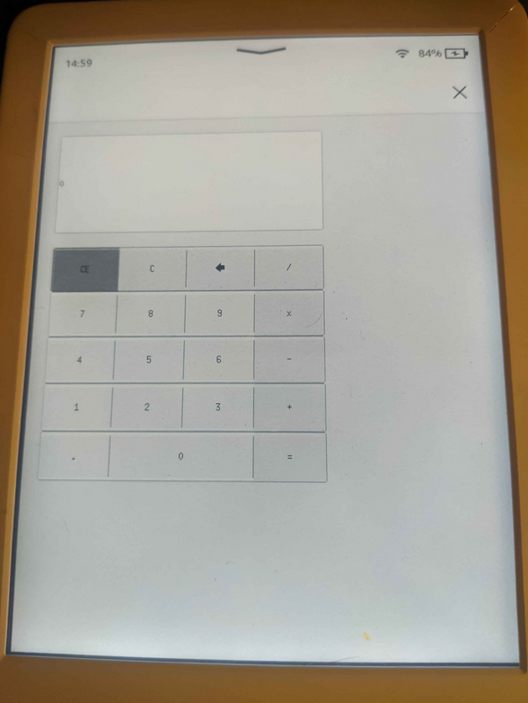

# kindle-fltk-rs
Sample calculator program using Rust and FLTK for Kindle GUI development on jailbroken `kindlehf`



`armv7-unknown-linux-gnueabi` (`kindlepw2`) build currently fails at `cannot find -lXcursor: No such file or directory`.
Contributions are welcome.

- fltk-rs documentation: [docs.rs/fltk](https://docs.rs/fltk/latest/fltk/)
- FLTK documentation: [fltk.org/doc-1.4](https://www.fltk.org/doc-1.4/index.html)
- More examples (though not necessarily for Kindle): [github.com/fltk-rs/fltk-rs#examples](https://github.com/fltk-rs/fltk-rs?tab=readme-ov-file#examples)
- Theming plugin: [crates.io/crates/fltk-theme](https://crates.io/crates/fltk-theme)
- Design GUIs interactively: [FLTK Rust: Latest FLUID, fl2rust and fltk-rs](https://youtu.be/33NdaW08fP8)
- Kindle Modding Wiki: [kindlemodding.org](https://kindlemodding.org/)

## Build
### Prerequisites
- Build tools for your platform (e.g. `build-essential`, `base-devel` etc.)
- [rust and cargo](https://rustup.rs/)
- [cross-rs](https://github.com/cross-rs/cross)
```
cargo install cross --git https://github.com/cross-rs/cross
```
- Docker

### For testing on desktop

```sh
cargo run
```

### For release on Kindle
```sh
cross build --target armv7-unknown-linux-gnueabihf --release -vv
```
Binary can be found in `target/armv7-unknown-linux-gnueabi*/release/sample`

### Cleaning up
```sh
cross clean
docker image prune -a # dangerous!!!
```

## License
[GPL-3.0](./LICENSE)
